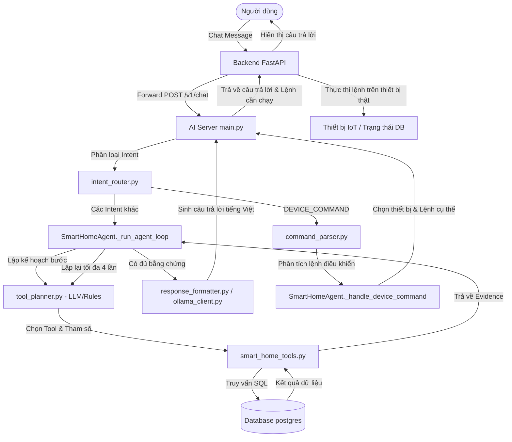

# Tài liệu Giải thích Kiến trúc và Logic hoạt động của Smart Home AI Server

Tài liệu này giải thích chi tiết cách thức hoạt động của **Smart Home AI Server**, cấu trúc thư mục, các thành phần cốt lõi (Intent Routing, Agent Loop, Tools, Memory), cách trích dẫn các đoạn code chính, và cách kết nối tích hợp với **Backend dự án hiện tại**.

---

## 1. Tổng quan về AI Server

AI Server là một ứng dụng **FastAPI** viết bằng Python, đóng vai trò là một trợ lý ảo thông minh hỗ trợ giám sát và điều khiển nhà thông minh (Smart Home Guardian Assistant). 

Điểm nổi bật của AI Server là kiến trúc **Tool-augmented RAG (Retrieval-Augmented Generation) Agent**. Nó không chỉ trả lời dựa trên dữ liệu tĩnh có sẵn của LLM, mà có thể tự động quyết định gọi các công cụ (Tools) để truy vấn cơ sở dữ liệu SQL (trạng thái thiết bị, lịch sử hoạt động, cảnh báo an ninh, gợi ý tối ưu) nhằm thu thập bằng chứng (evidence) chính xác trước khi đưa ra câu trả lời cuối cùng hoặc thực thi lệnh điều khiển.

---

## 2. Cấu trúc thư mục của `ai-server`

Thư mục `ai-server` được tổ chức như sau:

```text
ai-server/
├── app/
│   ├── api/             # Định nghĩa các endpoints REST API (FastAPI routes)
│   ├── agent/           # Logic lõi của Agent (Intent classifier, parser, agent loop, tool planner)
│   ├── db/              # Kết nối cơ sở dữ liệu SQLAlchemy
│   ├── llm/             # Tương tác với LLM thông qua Ollama (Prompts, Ollama Client)
│   ├── memory/          # Bộ nhớ ngữ cảnh hội thoại tạm thời (In-memory context)
│   ├── schemas/         # Định nghĩa cấu trúc dữ liệu đầu vào/đầu ra (Pydantic models)
│   ├── tools/           # Các tool truy vấn dữ liệu SQL dùng cho Agent
│   ├── config.py        # Quản lý cấu hình & biến môi trường
│   └── main.py          # Entrypoint khởi tạo FastAPI application
├── tests/               # Các test cases kiểm thử tự động
├── Dockerfile           # File cấu hình đóng gói container cho AI Server
└── requirements.txt     # Danh sách thư viện phụ thuộc của Python
```

---

## 3. Quy trình xử lý yêu cầu (Request Lifecycle)

Khi người dùng gửi một tin nhắn chat đến hệ thống, quy trình xử lý diễn ra theo trình tự sau:



---

## 4. Chi tiết logic các thành phần cốt lõi & Trích dẫn Code

### 4.1. Phân loại Ý định (Intent Classification)
Nằm tại file `ai-server/app/agent/intent_router.py`.
Hệ thống sử dụng các hàm chuẩn hóa văn bản tiếng Việt và biểu thức chính quy (Regex) hoặc tìm kiếm từ khóa để gán nhãn loại câu hỏi của người dùng.

*   **Các loại Intent chính:**
    *   `DEVICE_COMMAND`: Yêu cầu bật/tắt/điều khiển thiết bị.
    *   `DEVICE_STATUS_QUERY`: Hỏi trạng thái online/offline, đang bật hay tắt.
    *   `DEVICE_HISTORY`: Hỏi về lịch sử hoạt động, chạy bao lâu, bao nhiêu lần.
    *   `FORGOT_OFF_QUERY`: Hỏi về các thiết bị có thể đã bị quên tắt.
    *   `GUARDIAN_EVENT_QUERY`: Hỏi về cảnh báo, nguy hiểm, hoạt động bất thường.
    *   `SUGGESTION_EXPLAIN`: Hỏi lý do tại sao ứng dụng lại đưa ra các đề xuất/gợi ý cụ thể.
    *   `FOLLOW_UP`: Câu hỏi tiếp nối tận dụng thông tin ngữ cảnh cũ trong bộ nhớ.
    *   `GENERAL_SMART_HOME_QUERY`: Các câu hỏi chung chung khác.

*   **Code trích dẫn phân loại:**
    ```python
    # app/agent/intent_router.py
    def classify_intent(message: str) -> IntentResult:
        normalized = _normalize(message)
        needs_memory = any(
            phrase in normalized
            for phrase in ["the thi", "the tuan", "con ", "thiet bi do", "tai sao lai vay", "co nghiem trong"]
        )

        if any(word in normalized for word in ["quen tat", "hay bi quen", "forgot off"]):
            intent = "FORGOT_OFF_QUERY"
        elif any(word in normalized for word in ["bat thuong", "canh bao", "nguy hiem", "bao dong", "an ninh"]):
            intent = "GUARDIAN_EVENT_QUERY"
        elif any(word in normalized for word in ["tai sao", "t?i sao", "vi sao", "sao app", "goi y", "g?i", "de xuat"]):
            intent = "SUGGESTION_EXPLAIN"
        elif any(word in normalized for word in ["trang thai", "dang bat", "dang tat", "online", "offline"]):
            intent = "DEVICE_STATUS_QUERY"
        elif any(word in normalized for word in ["bao lau", "may lan", "lich su", "chay nhieu", "su dung", "hoat dong", "lau nhat"]):
            intent = "DEVICE_HISTORY"
        elif _looks_like_direct_command(normalized):
            intent = "DEVICE_COMMAND"
        elif needs_memory:
            intent = "FOLLOW_UP"
        else:
            intent = "GENERAL_SMART_HOME_QUERY"
    ```

---

### 4.2. Vòng lặp Agent (Agent Loop) & Công cụ (Tools)
Nằm tại file `ai-server/app/agent/agent.py` phương thức `_run_agent_loop` và `ai-server/app/tools/smart_home_tools.py`.

*   **Logic hoạt động:**
    Agent sẽ chạy qua tối đa 4 bước (định nghĩa bởi `MAX_AGENT_STEPS = 4`). Ở mỗi bước, Agent gửi thông tin ngữ cảnh hội thoại hiện tại kèm lịch sử các kết quả tool đã gọi ở các bước trước đó cho LLM (thông qua prompt đặc thù trong `tool_planner.py`). LLM sẽ trả về quyết định:
    1.  `{"action": "call_tool", "tool_call": {...}}`: Yêu cầu AI Server thực thi một hàm truy vấn cơ sở dữ liệu.
    2.  `{"action": "final", "answer": "..."}`: LLM thấy đã thu thập đủ thông tin để trả lời người dùng, kết thúc vòng lặp.
*   **Các database tools hỗ trợ:**
    *   `query_device_status`: Lấy trạng thái hiện tại (bật/tắt, online/offline) của thiết bị trong phòng.
    *   `query_activity_logs`: Truy vấn nhật ký đóng/mở, bật/tắt thiết bị (`activity_logs`).
    *   `query_user_patterns`: Xem thói quen sử dụng thiết bị được phân tích tự động (`user_patterns`).
    *   `query_suggestion_logs`: Xem lịch sử các gợi ý/cảnh báo tối ưu năng lượng đã gửi (`suggestion_logs`).
    *   `query_guardian_events`: Xem các sự kiện an ninh bất thường (`security_events`).
    *   `search_smart_home_records`: Tìm kiếm tổng hợp trên nhiều bảng dữ liệu khi từ khóa chung chung.

*   **Code trích dẫn SQL Tool (Ví dụ query_activity_logs):**
    ```python
    # app/tools/smart_home_tools.py
    rows = db.execute(text("""
        SELECT
            al.id,
            al.timestamp,
            al.session_end,
            al.duration_seconds,
            al.event_type::text AS event_type,
            al.trigger_source::text AS trigger_source,
            al.description,
            d.slug AS device_slug,
            d.name AS device_name,
            d.type::text AS device_type,
            r.name AS room_name
        FROM activity_logs al
        JOIN devices d ON d.id = al.device_id
        LEFT JOIN rooms r ON r.id = d.room_id
        WHERE al.home_id = CAST(:home_id AS uuid)
          AND (al.user_id = CAST(:user_id AS uuid) OR al.user_id IS NULL)
          AND al.timestamp >= :start
          AND al.timestamp < :end
        ORDER BY al.timestamp DESC
        LIMIT :limit
    """), params).mappings().all()
    ```

---

### 4.3. Phân tích & Trùng khớp Thiết bị cho Lệnh điều khiển (Device Command Handling)
Nằm tại file `ai-server/app/agent/command_parser.py` và hàm `_handle_device_command` trong `agent.py`.

Khi người dùng ra lệnh điều khiển (ví dụ: *"bật 2 cái quạt"* hay *"tắt toàn bộ đèn phòng khách ngoại trừ bếp"*):
*   `action`: Hành động (`turn_on`, `turn_off`, `lock`, `unlock`, `open`, `close`).
*   `device_hint`/`device_type_hint`: Gợi ý tên thiết bị hoặc loại thiết bị (`light`, `fan`, `ac`, `lock`).
*   `target_all`: Có phải tác động toàn bộ thiết bị thỏa mãn không (`True`/`False`).
*   `room_hint`/`exclude_room_hint`: Gợi ý phòng cần tác động (Ví dụ: "phòng ngủ", "ngoại trừ bếp").
*   `target_count`: Số lượng thiết bị tối đa cần tác động (Ví dụ: "2" cái quạt).

Sau đó, hàm `_handle_device_command` sẽ lấy danh sách thiết bị khả dụng từ cơ sở dữ liệu (thông qua kết quả của `query_device_status`), tính điểm trùng khớp (`_score_device`), lọc theo phòng và số lượng mong muốn rồi ánh xạ thành Payload lệnh thiết bị trả về cho backend.

*   **Code trích dẫn xử lý Room-based Filtering & Target Count:**
    ```python
    # app/agent/agent.py
    resolved_device_hint = parsed_command.device_hint or device_hint
    controllable = _candidate_devices_for_command(evidence, parsed_command)
    if parsed_command.room_hint:
        room_hint_norm = _normalize_text(parsed_command.room_hint)
        controllable = [
            item
            for item in controllable
            if room_hint_norm
            in " ".join(
                [
                    _normalize_text(item.get("room_name")),
                    _normalize_text(item.get("device_name")),
                    _normalize_text(item.get("device_slug")),
                ]
            )
        ]
    # Lọc bỏ các thiết bị ở phòng bị loại trừ (nếu có phrase "ngoại trừ...")
    if parsed_command.exclude_room_hint:
        exclude_room_hint_norm = _normalize_text(parsed_command.exclude_room_hint)
        controllable = [
            item
            for item in controllable
            if exclude_room_hint_norm
            not in " ".join(
                [
                    _normalize_text(item.get("room_name")),
                    _normalize_text(item.get("device_name")),
                    _normalize_text(item.get("device_slug")),
                ]
            )
        ]
    # Sắp xếp các thiết bị theo điểm số trùng khớp tên/slug
    ranked = sorted(
        controllable,
        key=lambda item: _score_device(item, resolved_device_hint),
        reverse=True,
    )
    # Giới hạn số lượng thiết bị điều khiển (target_count)
    limit = parsed_command.target_count if parsed_command.target_count is not None else 1
    selected_devices = []
    for item in ranked:
        if len(selected_devices) >= limit:
            break
        if str(item.get("id")) not in used_device_ids and _score_device(item, resolved_device_hint) > 0:
            selected_devices.append(item)
    ```

---

### 4.4. Bộ nhớ ngữ cảnh (Conversation Memory Context)
Nằm tại file `ai-server/app/memory/memory_store.py`.

Hệ thống duy trì một đối tượng `InMemoryStore` lưu trữ thông tin hội thoại gần nhất của mỗi cặp người dùng (`user_id`) và phiên hội thoại (`session_id`). Bộ nhớ này lưu trữ các thông tin:
*   `last_intent`: Ý định của câu hỏi trước đó.
*   `last_device_slug`/`last_device_name`: Thiết bị được đề cập gần nhất.
*   `last_devices`: Danh sách các thiết bị vừa được tương tác.
*   `last_time_range`: Khoảng thời gian đang được truy vấn trước đó.

Nhờ đó, khi người dùng nói tiếp một câu ngắn không đầy đủ như *"thế thì bật nó lên"* hay *"còn tối qua thì sao"*, Agent có thể tự phục hồi lại tên thiết bị hoặc khoảng thời gian từ ngữ cảnh cũ (tương ứng với intent `FOLLOW_UP`).

---

### 4.5. Tương tác Sinh phản hồi qua LLM
Nằm tại file `ai-server/app/llm/ollama_client.py`.

Sau khi kết thúc vòng lặp Agent và thu thập được các bằng chứng (`evidence`) từ cơ sở dữ liệu, nếu không có câu trả lời cứng (deterministic), Agent sẽ gửi toàn bộ câu hỏi người dùng, ngữ cảnh bộ nhớ và danh sách bằng chứng dạng JSON cấu trúc gọn gàng đến mô hình LLM tại Ollama (mặc định là `qwen2.5:3b`) để tạo câu trả lời tiếng Việt thân thiện, đồng thời phân tích mức độ nghiêm trọng (`severity`) và đề xuất hành động tiếp theo (`suggested_actions`).

---

## 5. Cách kết nối và tích hợp giữa AI Server và Backend dự án hiện tại

Việc kết nối giữa hai dịch vụ này được cấu hình thông qua API HTTP và các biến môi trường cấu hình động.

### 5.1. Cấu hình bên phía Backend dự án chính
Trong file cấu hình của backend chính `backend/src/config/env.py`, có hai biến môi trường chịu trách nhiệm định tuyến cuộc gọi đến AI Server:

```python
# backend/src/config/env.py
AI_SERVER_URL = os.getenv("AI_SERVER_URL", "http://localhost:8100")
AI_SERVER_API_KEY = os.getenv("AI_SERVER_API_KEY", "change_me")
```

*   `AI_SERVER_URL`: Địa chỉ máy chủ AI Server chạy dịch vụ FastAPI. Trong môi trường docker-compose, giá trị này là `http://ai-server:8100` hoặc chạy localhost cục bộ là `http://localhost:8100`.
*   `AI_SERVER_API_KEY`: API Key bảo mật dùng để xác thực đầu vào giữa Backend và AI Server (gửi qua header `X-API-Key`).

---

### 5.2. Service gửi yêu cầu của Backend đến AI Server
Nằm tại file `backend/src/apis/ai_chat/service.py`.
Backend dùng thư viện `httpx` để thực hiện các cuộc gọi API HTTP POST bất đối xứng (async) chuyển tiếp payload tin nhắn chat đến AI Server:

```python
# backend/src/apis/ai_chat/service.py
async def forward_chat(payload: dict) -> dict:
    headers = {}
    if AI_SERVER_API_KEY:
        headers["X-API-Key"] = AI_SERVER_API_KEY

    try:
        async with httpx.AsyncClient(timeout=90) as client:
            response = await client.post(
                f"{AI_SERVER_URL.rstrip('/')}/v1/chat",
                json=payload,
                headers=headers,
            )
            response.raise_for_status()
            return response.json()
    ...
```

---

### 5.3. Điều phối phản hồi và Thực thi thiết bị tại Controller Backend
Nằm tại file `backend/src/apis/ai_chat/controller.py`.
Đây là nơi gắn kết quan trọng nhất. Khi nhận phản hồi từ AI Server, Controller của Backend kiểm tra xem có trường `device_commands` (hoặc `device_command`) nào hay không:

*   Nếu **không** có lệnh điều khiển (người dùng chỉ hỏi thông tin lịch sử hoặc giải thích gợi ý): Backend chỉ nhận câu trả lời dạng text và hiển thị cho người dùng.
*   Nếu **có** lệnh điều khiển:
    1.  Backend lặp qua từng lệnh thiết bị nhận được (`device_id` và `command`).
    2.  Gọi hàm logic thiết bị hiện tại `device_service.send_command` để kích hoạt thiết bị thật qua giao thức kết nối MQTT/WebSocket hoặc thay đổi trạng thái trong DB thực tế.
    3.  Cập nhật phản hồi text thông báo thiết bị nào đã được điều khiển thành công.

*   **Đoạn Code xử lý điều phối lệnh trong Controller:**
    ```python
    # backend/src/apis/ai_chat/controller.py
    commands = ai_response.get("device_commands") or []
    if not commands and ai_response.get("device_command"):
        commands = [ai_response["device_command"]]
    if not commands:
        return ai_response

    command_results = []
    for command in commands:
        executed_device = device_service.send_command(
            db,
            UUID(command["device_id"]),
            user_id,
            device_models.DeviceCommandRequest(
                command=command["command"],
                value=command.get("value"),
            ),
        )
        command_results.append(device_service.to_response(executed_device).model_dump(mode="json"))

    ai_response["command_executed"] = True
    ai_response["command_result"] = command_results[0] if len(command_results) == 1 else None
    ai_response["command_results"] = command_results
    ...
    ```

---

## 6. Tổng kết
Kiến trúc này tách biệt hoàn toàn phần xử lý ngôn ngữ tự nhiên, lập kế hoạch (AI Server) và phần thực thi nghiệp vụ thông minh kết nối thiết bị phần cứng (Backend chính). 

Sự phân tách này mang lại 3 lợi ích lớn:
1.  **Tính an toàn:** LLM không có quyền tự do ghi dữ liệu trực tiếp vào database hay tự gửi tín hiệu phần cứng. Nó chỉ đề xuất lệnh và backend chính kiểm tra phân quyền thành viên trước khi chạy lệnh thật.
2.  **Khả năng mở rộng độc lập:** Có thể nâng cấp LLM (từ qwen 3B lên các model lớn hơn như Llama-3, GPT-4) hoặc thay đổi logic Agent ở phía AI Server mà không cần viết lại mã nguồn xử lý IoT của Backend.
3.  **Tốc độ thực thi:** Các câu lệnh trực tiếp đơn giản được phân tích cú pháp tĩnh bằng Regex/Rules nhanh chóng ở AI Server, không cần qua mô hình LLM, đảm bảo độ trễ phản hồi cực thấp khi điều khiển thiết bị.
