# Smart Home Analytics Pipeline - Data -> Preprocess -> ML -> Suggestion

File nay tom tat de doc nhanh 2 script:
- `backend/scripts/run_analytics.py`
- `backend/scripts/run_llm_formatter.py`

Muc tieu: bien activity_logs thanh goi y thuc te cho nguoi dung trong suggestion_logs.

---

## 1) Tong quan end-to-end

```mermaid
flowchart TD
    A[activity_logs + users + homes] --> B[run_analytics.py]
    B --> C1[Rule-based TIME_HABIT]
    B --> C2[KMeans CLUSTER]
    B --> C3[Statistical ANOMALY]
    C1 --> D[user_patterns]
    C2 --> D
    C3 --> D
    D --> E[run_llm_formatter.py]
    E --> F[Prompt builder theo pattern]
    F --> G[Ollama/Claude]
    G --> H[Parse JSON]
    H --> I[suggestion_logs]
```

---

## 2) Data input lay tu dau?

Trong `run_analytics.py`, data duoc lay truc tiep bang SQLAlchemy + raw SQL:

- Bang `homes`: lay cac home dang active.
- Bang `users` + `home_users`: lay user active trong tung home.
- Bang `activity_logs`: nguon chinh cho phan tich.

Bo loc du lieu quan trong:
- `event_type = 'DEVICE_ON'`
- trigger source uu tien hanh vi nguoi dung:
  - `USER`
  - `PHYSICAL_ATTRIBUTED`
- Loc theo cua so thoi gian (`lookback_days`) cho tung bai toan.

Timezone duoc chuan hoa theo `Asia/Ho_Chi_Minh` khi rut trich gio/thu.

---

## 3) Preprocess trong run_analytics.py

### 3.1 Rule-based habit (TIME_HABIT)

Ham: `mine_time_habits(...)`

Tien xu ly:
- Trich xuat feature theo su kien:
  - `hour` (0-23)
  - `dow` (thu trong tuan)
  - `duration_seconds`
- Gom nhom theo `(device_id, hour)`
- Tong hop:
  - `dows = ARRAY_AGG(DISTINCT dow)`
  - `cnt = COUNT(*)`
  - `avg_dur_min = AVG(duration_seconds)/60`
- Loc bo nhom it mau: `HAVING COUNT(*) >= HABIT_MIN_OCCURRENCES` (mac dinh 3)

Output preprocess:
- Danh sach habit cho tung user voi:
  - device_id
  - hour
  - days_of_week
  - avg_dur_min
  - occurrences
  - confidence (tinh heuristic theo tan suat trong cua so lookback)

Sau do `save_time_habits(...)`:
- Tat (`is_active=false`) pattern TIME_HABIT cu.
- Insert pattern moi vao `user_patterns`.

### 3.2 Feature engineering cho KMeans (CLUSTER)

Ham: `extract_feature_vector(...)`

Dieu kien du data:
- Neu user co < 20 events thi bo qua (`None`).

Vector 27 chieu:
- 24 chieu dau: tan suat theo gio `h0..h23` (normalize theo tong so event)
- 1 chieu: `unique_ratio = so device da dung / tong device dinh nghia`
- 1 chieu: `weekend_ratio = so event T7/CN / tong event`
- 1 chieu: `avg_dur_hours = trung binh duration_seconds / 3600`

Tien xu ly truoc clustering:
- Tao ma tran X tu cac vector user hop le.
- Chuan hoa `StandardScaler` -> `X_scaled`.

### 3.3 Anomaly preprocess (ANOMALY)

Ham: `detect_anomalies(...)`

Tien xu ly theo tung device:
- Tinh thong ke nen:
  - `avg_dur`
  - `std_dur`
  - `cnt`
- Chi xet device co du mau: `COUNT(*) >= 5`
- Dat nguong bat thuong:
  - `threshold = avg_dur + 2 * std_dur`
- Tim outlier: cac lan `duration_seconds > threshold`

Output preprocess:
- Danh sach anomaly theo device voi avg, threshold, occurrences.

Sau do `save_anomalies(...)`:
- Tat pattern ANOMALY cu.
- Insert pattern moi vao `user_patterns`.

---

## 4) ML trong script nay la gi?

### 4.1 Phan co ML thuc su: KMeans

Ham: `run_kmeans(...)`

Pipeline ML:
1. Thu vector user (`extract_feature_vector`).
2. Bo user khong du data.
3. Scale du lieu bang `StandardScaler`.
4. Chay `KMeans` (k toi da 3, tuy so user hop le).
5. Gan nhan cum theo rule heuristic tu centroid (`label_cluster`).
6. Luu ket qua vao `user_patterns` voi `pattern_type = CLUSTER`.

Luu y:
- Khong phai supervised learning (khong can label train).
- Day la unsupervised clustering de mo ta phong cach su dung thiet bi.

### 4.2 Phan khong phai ML

- TIME_HABIT: Rule-based aggregation.
- ANOMALY: Statistical threshold (`mean + 2*std`), khong dung model hoc may.

---

## 5) run_llm_formatter.py lam gi voi output analytics?

Script nay doc `user_patterns` active roi bien thanh goi y ngon ngu tu nhien.

### 5.1 Data ingestion

Trong `format_suggestions_for_home(...)`:
- Join `user_patterns` voi `users`.
- Loc:
  - `is_active = true`
  - `confidence >= 0.5`

### 5.2 Preprocess truoc khi goi LLM

Cho moi pattern:
- Build context co cau truc bang `build_prompt(...)`:
  - TIME_HABIT -> de nghi tao lich (SCHEDULE)
  - ANOMALY -> canh bao (ALERT)
  - CLUSTER -> tong ket hanh vi + de xuat toi uu (AUTOMATION)
- Prompt bat model tra ve JSON (de parse on dinh).

### 5.3 "Model" o day la LLM formatter

`call_llm(...)` chon provider theo env:
- Ollama local (`/api/generate`)
- Claude API

Dau ra LLM:
- Text JSON gom `title`, `description`, `action_type`, `schedule_payload`.

### 5.4 Postprocess + save

`parse_llm_output(...)`:
- Bo markdown fence neu co.
- Parse JSON.

Truoc khi luu:
- Check duplicate suggestion trong 7 ngay theo `(user_id, pattern_id)`.

Luu bang `suggestion_logs`:
- `action_type` map sang enum
- `suggestion_text`
- `suggestion_json` (chi tiet de app/mobile dung lai)

---

## 6) Dieu kien toi thieu de pipeline chay hieu qua

Trong `run_analytics.py`:
- Rule-based can it nhat `MIN_DAYS_RULE_BASED = 7` ngay data.
- KMeans can it nhat `MIN_DAYS_KMEANS = 30` ngay data.
- KMeans can it nhat `MIN_USERS_KMEANS = 2` users hop le.

Neu khong du dieu kien thi script tu dong skip tung pha.

---

## 7) Tom tat ngan gon theo dung yeu cau "data -> preprocess -> ML"

1. Data:
   - Lay log tu `activity_logs`, user/home tu `users`, `home_users`, `homes`.
2. Preprocess:
   - Timezone convert, group-by theo gio/thu/device, tao feature vector 27 chieu, chuan hoa scaler, tinh thong ke mean/std.
3. ML:
   - KMeans clustering tren vector user (unsupervised).
   - Rule-based + anomaly statistical bo tro de tao pattern de hieu.
4. Output trung gian:
   - Luu vao `user_patterns` (TIME_HABIT, CLUSTER, ANOMALY).
5. LLM formatting:
   - Bien pattern thanh cau goi y tieng Viet co cau truc JSON, luu vao `suggestion_logs`.

---

## 8) Cac bien moi truong can nho

- `DATABASE_URL`
- `LLM_PROVIDER` = `ollama` | `claude`
- `OLLAMA_URL`
- `OLLAMA_MODEL`
- `ANTHROPIC_API_KEY` (neu dung Claude)
